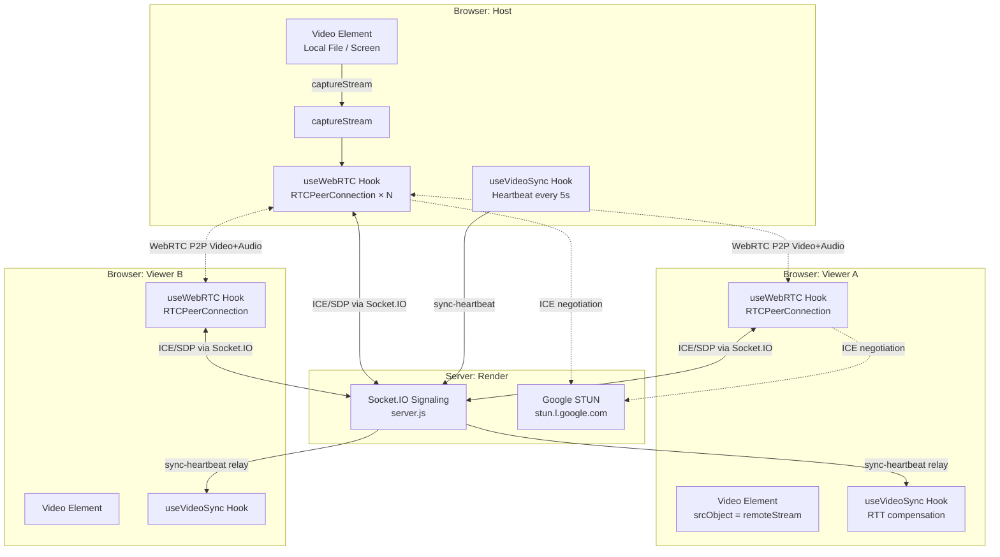

# 🎬 Movie Watch Party — WebRTC Architecture

## System Overview



---

## Signaling Flow (Step by Step)

### Phase 1 – Room Setup
```
Host             Server (Socket.IO)         Viewer
  |                      |                     |
  |── create-room ──────>|                     |
  |<─ roomId ───────────|                     |
  |                      |<── join-room ───────|
  |                      |──stream-status ────>|
  |                      |──user-joined ──────>|  (triggers host to initiate WebRTC)
```

### Phase 2 – WebRTC Negotiation (per viewer)
```
Host             Server (Socket.IO)         Viewer
  |── start-stream ─────>|                     |
  |                      |── stream-started ──>|
  |                      |<── request-stream ──|
  |<─ request-stream ───|                     |
  |                      |                     |
  |─ createOffer() ──>  |                     |
  |── webrtc-offer ─────>|── webrtc-offer ────>|
  |                      |                  setRemoteDesc()
  |                      |                  createAnswer()
  |                      |<── webrtc-answer ───|
  |<─ webrtc-answer ────|                     |
  |  setRemoteDesc()     |                     |
  |                      |                     |
  |<── ICE candidates ──>|<── ICE candidates ──|  (buffered until remoteDesc set)
  |                      |                     |
  |════════ P2P Video+Audio Stream ════════════|  (direct, no server relay)
```

### Phase 3 – Playback Sync (ongoing)
```
Host (every 5s)    Server              Viewer
  |                    |                  |
  |── sync-heartbeat ─>|── heartbeat ────>|
  |   { playing,       |   relay          |   RTT / 2 offset applied
  |     currentTime,   |                  |   Soft: adjust playbackRate ±0.05
  |     serverTime }   |                  |   Hard: hard seek if drift > 0.8s
```

---

## ICE Candidate Buffering (Critical Fix)

**Old problem**: ICE candidates were emitted before the receiver had called `setRemoteDescription()`, causing them to be silently dropped.

**Fix** in `useWebRTC.js`:
```js
// Buffer candidates until remote description is set
if (remoteDescSet.current[from]) {
  await pc.addIceCandidate(new RTCIceCandidate(candidate));
} else {
  iceCandidateQueue.current[from].push(candidate);  // buffered
}

// Flush buffer AFTER setRemoteDescription()
await pc.setRemoteDescription(offer);
remoteDescSet.current[from] = true;
await flushIceCandidates(from);  // drain queue
```

---

## Latency Compensation

```
Viewer's expected position = host.currentTime + (RTT / 2 / 1000s) + elapsed_since_server_timestamp

Drift = expectedTime - video.currentTime

| Drift         | Action                          |
|---------------|----------------------------------|
| < 0.15 s      | Do nothing (within tolerance)   |
| 0.15 – 0.8 s  | playbackRate ± 0.05 (smooth)    |
| > 0.8 s       | video.currentTime = expectedTime |
```

RTT is measured every 10 seconds with a `ping-rtt`/`pong-rtt` echo on Socket.IO.

---

## Audio Fix

**Old problem**: `canvas.captureStream()` produces a video-only stream — no audio.

**Fix**:
```js
// ✅ Correct: captureStream from video element (includes decoded audio)
const stream = videoElement.captureStream();
// stream.getTracks() → [ VideoStreamTrack, AudioStreamTrack ]

// ❌ Wrong: canvas has no audio decoder
const stream = canvas.captureStream(30);
// stream.getTracks() → [ VideoStreamTrack ]  ← audio missing!
```

For **screen share**, `getDisplayMedia({ audio: true })` already returns a MediaStream with both audio and video — no canvas needed.

---

## STUN / TURN Configuration

### STUN (Free — for most networks)
The app uses Google's free STUN servers:
- `stun:stun.l.google.com:19302`
- `stun:stun1.l.google.com:19302`
- `stun:stun2.l.google.com:19302`

These handle ~85% of connections (residential/mobile NAT).

### TURN (Required for corporate / symmetric NAT)
Set these environment variables in `frontend/.env.local` or `frontend/.env.production`:

```bash
REACT_APP_TURN_URL=turn:your-turn-server.com:3478
REACT_APP_TURN_USERNAME=your_username
REACT_APP_TURN_CREDENTIAL=your_password
```

**Free TURN options**:
- [Metered.ca](https://www.metered.ca/) — 50 GB/month free
- [Twilio STUN/TURN](https://www.twilio.com/docs/stun-turn) — pay-as-you-go

---

## Production Topology

```
                    ┌─────────────────────────────┐
                    │   Vercel (React Frontend)    │
                    │   movie-party-bice.vercel.app│
                    └──────────────┬──────────────┘
                                   │ Socket.IO
                    ┌──────────────▼──────────────┐
                    │   Render (Node.js Backend)   │
                    │   Signaling only, no media   │
                    └─────────────────────────────┘
                              ▲           ▲
                   ICE/SDP    │           │   ICE/SDP
              ┌───────────────┘           └─────────────┐
              │                                          │
    ┌─────────▼──────────┐              ┌───────────────▼──────┐
    │   Host Browser     │              │   Viewer Browser     │
    │   (Chrome/Edge)    │◄────P2P─────►│   (Chrome/Edge)      │
    └────────────────────┘   WebRTC     └──────────────────────┘
             ↑
    Google STUN / TURN server (for NAT traversal)
```

**Key point**: After signaling, all video/audio flows **directly peer-to-peer** — the Render server carries zero media traffic.

---

## Scaling Considerations

| Users | Architecture | Notes |
|-------|-------------|-------|
| 1–8   | Full mesh (this implementation) | Each peer connects to every other peer |
| 8–50  | SFU (Selective Forwarding Unit) | MediaSoup, LiveKit, or Janus |
| 50+   | CDN streaming (HLS/DASH) | Host stream → CDN → viewers |

For a watch party, 8 simultaneous viewers is a reasonable practical limit before switching to an SFU. The `useWebRTC` hook's design is intentionally structured to make upgrading to an SFU straightforward — just swap what `remoteStream` is set from.

---

## Browser Compatibility

| Feature | Chrome | Firefox | Edge | Safari |
|---------|--------|---------|------|--------|
| `RTCPeerConnection` | ✅ | ✅ | ✅ | ✅ |
| `video.captureStream()` | ✅ | ✅ (mozCaptureStream) | ✅ | ❌ |
| `getDisplayMedia` | ✅ | ✅ | ✅ | ✅ (macOS 13+) |
| `playbackRate` adjust | ✅ | ✅ | ✅ | ✅ |

> **Safari host note**: `captureStream()` is not supported on Safari. Safari users can still join as viewers or use screen share. A canvas-based fallback could be added for file hosting on Safari if needed.
